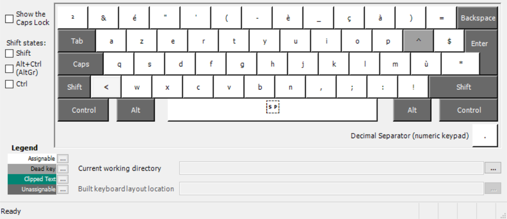

# Overview

Mac/Ubuntu keyboard layout on Windows for regular AZERTY keyboards users.

This layout allows users to find the simplicity of using a Mac or Ubuntu keyboard on a keyboard intended for use on Windows. It especially allows you to write special characters É, È, Ç, and À by pressing CAPS LOCK.

It has been created using [Microsoft Keyboard Layout Creator](https://www.microsoft.com/en-us/download/details.aspx?id=22339).

## Utilities

### Normal state

### By pressing shift

### By pressing CAPS LOCK

### By pressing Shift and CAPS LOCK

## Installing

Install from the [FrHandy releases page](https://github.com/lcarne/FrHandy/releases). Click on `Assets` to show the files available in the release and then click on `frhandy.zip` to download the installer.

Note: Working under Windows 10.

Unzip the file and click on `setup.exe`. After installing it go to `Settings` ➡ `Typing setting` ➡ `Advanced keyboard settings` and select `Le Handy French Keyboard` on the dropdown selection.
You are set to go!
